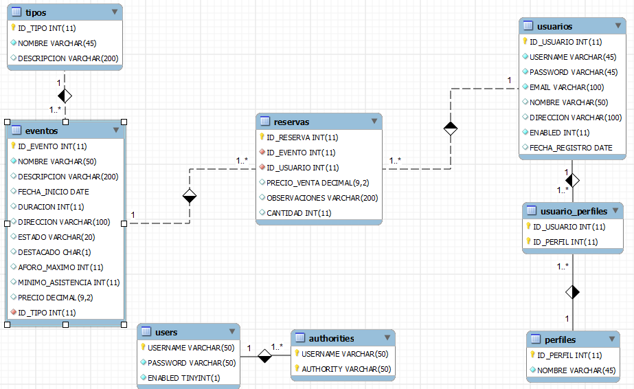

# AI-5. Microservicios web con Spring Boot

## Enunciado

Nombre del proyecto

group: com.ite.minombre

artefacto: resteventos

En la aplicación de eventos que hicimos con anterioridad vamos a exponer una serie de servicios para que otras aplicaciones puedan consultar datos acerca de los eventos.

El modelo de datos es el mismo que los ejercicios anteriores:

## Desarrollo

Casos de uso (URL general: “/rest/eventos”):

- **“/activos”:** Devolver todos los eventos activos.
- **“/destacados:** Devolver todos los eventos destacados.
- **“/buscarEventos/{subcadena}":** Devolvemos todos los eventos cuyo nombre de evento contenga la cadena de caracteres introducida por PathVariable en la URL.
- **“/plazasQuedan/{idEvento}":** Devolvemos el numero de plazas que quedan sin reservar, de la forma {“quedan_plazas” : 26}
- **“/verUno/{idEvento}”:** Devolvemos el Evento cuyo código de evento coincida con el introducido por PathVariable en la URL.
- **“/alta“:** Nos pasan un json con los datos del evento y lo damos de alta, la salida es un mensaje “Evento dado de Alta”.
- **“/modificar“:** Nos pasan un json con los datos del evento y lo modificamos en la base de datos, la salida es un mensaje “Evento Modificado”.
- **“/eliminar/{idEvento}”:** Nos pasan por @PathVariable el identificador del evento y lo eliminamos de la tabla, la salida es un mensaje “Evento Eliminado”.

Una vez terminado, desplegar y probar con Postman.
